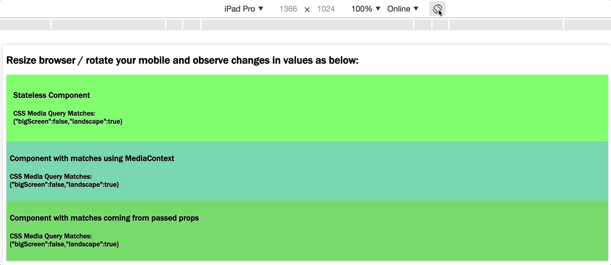

# react-mql

[](https://circleci.com/gh/kumarabhishek/react-mql/tree/master)

`CSS Media Queries HOC and MediaContext for React`



## Introduction

A React based component to match media as per CSS Media Queries using browser-native window.matchMedia(). `react-mql` provide two components namely `Media` and `MediaContext`. Both these components can have just one single functional component as only child.

Use `<Media>` as the top most component which accept list of media queries as prop and it passes on the matches to its immediate single functional component. In case we need to have statefull component as child of `<Media>` then it need to be enclosed inside functional component wrapper.

`MediaContext` is a helper component which can be used anywhere and any number of times in the component sub-tree inside `Media`. It is more helpfull when we do not want to keep passing media query matches as `props` down the component sub-tree. Anywhere in the sub-tree when we need to access `matches` we can get using `MediaContext`.

## Features

* It has **ZERO** dependencies and is **< 1KB** (gzipped) in size.
* It is purely based on browser native HTML5 feature _[MediaQueryList](https://developer.mozilla.org/en-US/docs/Web/API/MediaQueryList)_.
* Uses latest React 16.x _[Context](https://reactjs.org/docs/context.html)_ API


## Install

```
npm i @kaweb/react-mql
```

## Usage

`react-mql` provide both es5 and es6+ version so that you can choose based on your requirement. Default package is es5 version which can be imported in your application as below:

```js
import Media, {MediaContext} from '@kaweb/react-mql';
```

Similary es6+ version can be imported as below:

```js
import Media, {MediaContext} from '@kaweb/react-mql/lib/es';
```

It's noticeable that if you are targeting modern browser natively supporting es6+, then `@kaweb/react-mql/lib/es` will just around 2 Kb (non-gzipped) and around 1 Kb (gzipped). While es5 version of the same module is around 10 Kb (non-gzipped) and around 4 Kb (gzipped). In short around 80% benefit of size is available if you choose es6+ version.

* **Media component**

`Media` accept following props:

Name | type | Description         | Example
-----|------|---------------------|---------
list |Object| Object with key as media-query name and value as _CSS media queries_. | ```{landscape: '(orientation: landscape)'}```, where `landscape` is media-query name and `'(orientation: landscape)'` is media-query value. When there is a match for this media-query, matches object provided to functional component will be ```{landscape: true/false}```
dev | Boolean | Enable/disable console log when media-queries matches. | <Media dev>
```js
import React from 'react';
import Media from '@kaweb/react-mql/lib/es';

const CompStateless = (props) => {
  return <div style={{background: props.bigScreen ? '#edeeed' : '#66ee66', padding: '1rem'}}>
    <h3>Stateless Component</h3>
    <h4>CSS Media Query Matches:<br/>{JSON.stringify(props, 4)}</h4>
  </div>
};

class CompMatchesAsProps extends React.Component {
	render() {
		return <div style={{ background: this.props.bigScreen ? '#ffccff' : '#66cc66', padding: '0.5rem' }}>
			<h3>Component with matches coming from passed props</h3>
			<h4>CSS Media Query Matches:<br/>{JSON.stringify(this.props, 4)}</h4>
		</div>;
	}
}

class App extends React.Component {
  constructor(props){
    super(props);
    
    this.list = {
      bigScreen: '(min-width: 100px) and (max-width: 1080px)',
      landscape: '(orientation: landscape)'
    };
  }

  render(){
    return <React.Fragment>
      <h2>Resize browser window / rotate mobile and observe changes in values as below:</h2>
      Toggle listening for MediaQueryList</button>
      <Media list={this.list} dev>
        {CompStateless}
      </Media>
      <Media list={this.list} dev>
        { v => <CompMatchesAsProps {...v}/>}
      </Media>
    </React.Fragment>;
  }
};
```

* **MediaContext component**

```js
import React from 'react';
import Media, {MediaContext} from '@kaweb/react-mql/lib/es';

class CompMatchesUsingMediaContext extends React.Component {
	render() {
		return <MediaContext>
			{ v => (
				<div style={{ background: v.bigScreen ? '#aaccee' : '#66ccaa', padding: '0.5rem' }}>
					<h3>Component with matches using MediaContext</h3>
					<h4>CSS Media Query Matches:<br/>{JSON.stringify(v, 4)}</h4>
				</div>
			)}
		</MediaContext>;
	}
}

class App extends React.Component {
  constructor(props){
    super(props);
    
    this.list = {
      bigScreen: '(min-width: 100px) and (max-width: 1080px)',
      landscape: '(orientation: landscape)'
    };
  }

  render(){
    return <React.Fragment>
      <h2>Resize browser / rotate mobile and observe changes in values as below:</h2>
      <Media list={this.list} dev>
        { () => <CompMatchesUsingMediaContext />}
      </Media>
    </React.Fragment>;
  }
};
```

[Check out live demo](https://kumarabhishek.github.io/apps/react-mql/index.html).

## Example

To try out example provided as part of react-mql follow following steps:

### Clone repo

```
git clone https://github.com/kumarabhishek/react-mql.git
```

### Install npm modules

```
npm i
```

### Run example

```
npm start
```

Now open [http://localhost:3000](http://localhost:3000).

## Tests

Jest is used for unit testing with coverage ans eslint is used as linter. To run the test suite, first install the dependencies, then run `npm test` inside root folder:

```
npm test
```


## Contributing

Your contributions are welcome!

Refer [contributing guide](./CONTRIBUTING.md) for more details.
